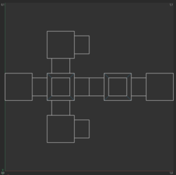

# Wireframe Generator

This is a simple tool that takes an `.obj` model and generates a corresponding (clean) wireframe texture.
Unless specified otherwise, the generated wireframe will contain no support edges, i.e. additional edges that
technically don't contribute to the shape of the geometry and only exist due to triangulation,
avoiding N-Gons, or to prevent impossible geometry.

The following table shows some example screenshots.

|            | Model                  | Wireframe                            | Clean wireframe                        |
|------------|------------------------|--------------------------------------|----------------------------------------|
| Model view |  |  |  |
| UV view    |     |            |        |


# Usage

See also `./wireframe.py -h`

```text
usage: wireframe.py [-h] [--flipy] [-r RESOLUTION] [-w WIDTH] [-ss SUPERSAMPLE] [-a] obj_file out_file

Generate a clean wireframe for a given .obj model.

positional arguments:
  obj_file              Input obj file.
  out_file              Output image file path.

options:
  -h, --help            show this help message and exit
  --flipy               Flip Y UVs.
  -r RESOLUTION, --resolution RESOLUTION
                        Texture resolution. Default: 1024.
  -w WIDTH, --width WIDTH
                        Line width. Default: 1.
  -ss SUPERSAMPLE, --supersample SUPERSAMPLE
                        Use super-sampling to produce anti-aliased lines. A value <= 1 means no super-sampling
                        (default). Default: 1
  -a, --all             Render all edges, don't remove support edges.
```

## Examples

```sh
# Render a wireframe of example.obj to wireframe.png with a resolution of 2048x2048
./wireframe.py example/example.obj wireframe.png -r 2048

# Render a wireframe with line width of 3px
./wireframe.py example/example.obj wireframe.png -w 3

# Render a wireframe with 2x super-sampling to produce anti-aliased lines
./wireframe.py example/example.obj wireframe.png -ss 2

# Render a wireframe with all edges and without removing support edges.
./wireframe.py example/example.obj wireframe.png --all
```


# How it works

- Load the `.obj`
- For each unique edge in the model:
  - Store each face it is part of
  - If there is more than one face:
    - Compute face normals
    - If all connected faces have the same normal (i.e. are all part of a larger planar surface):
      - Remove the edge
- For all remaining edges:
  - Render them to an image
